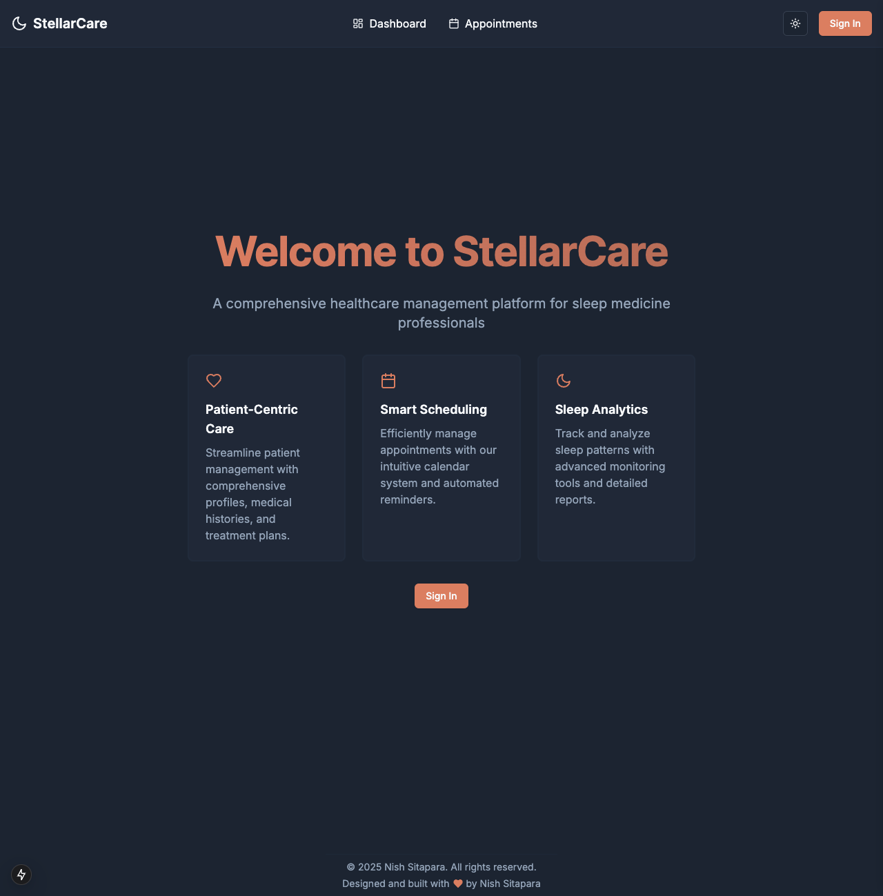
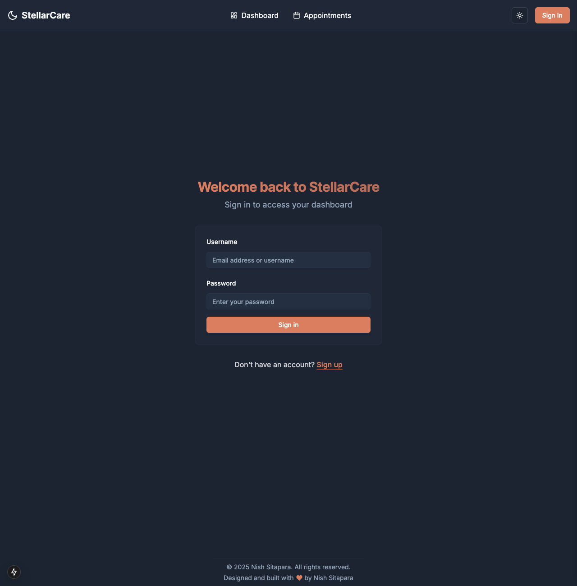
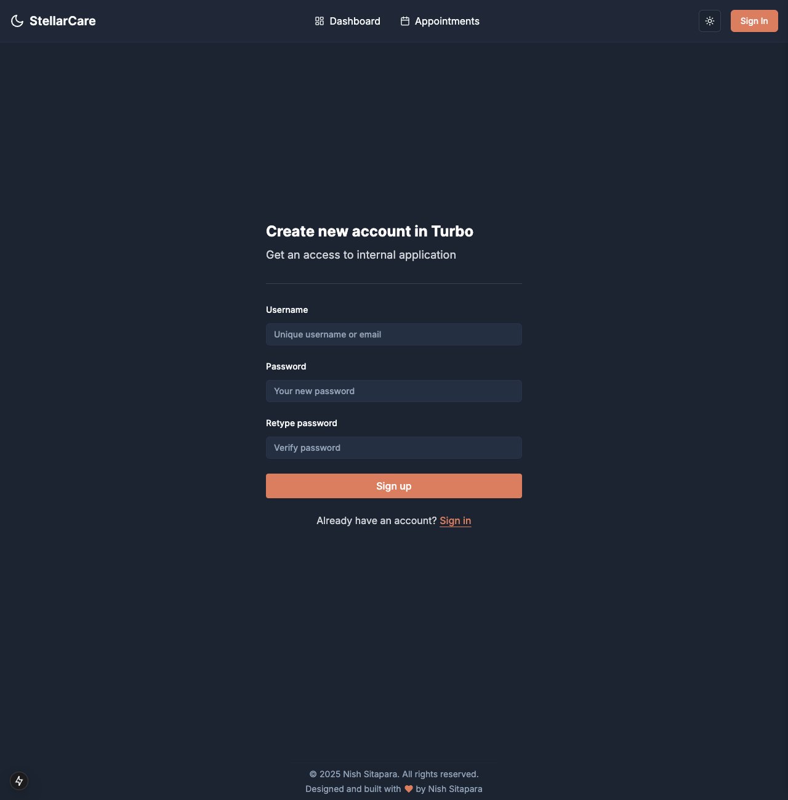
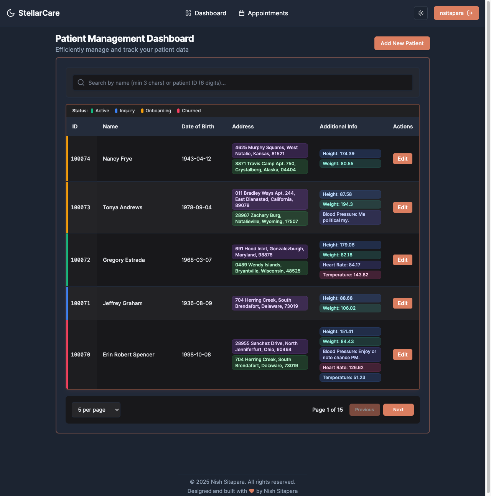
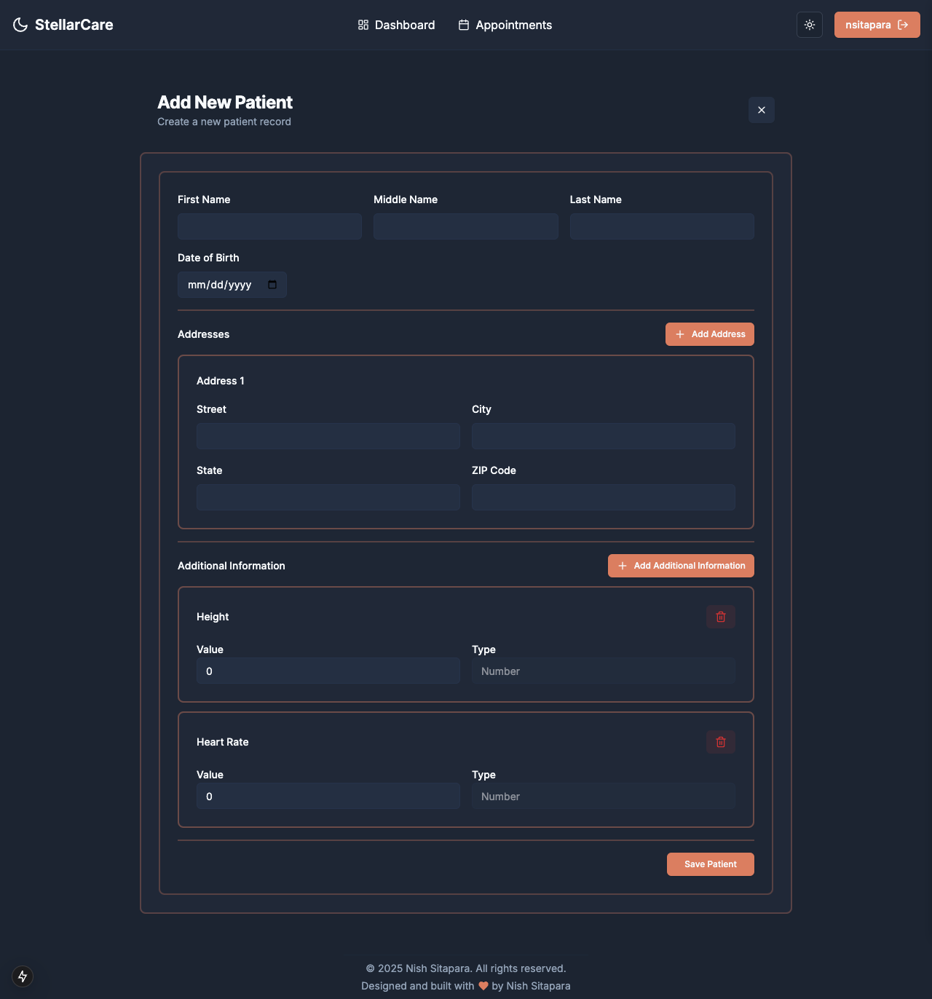
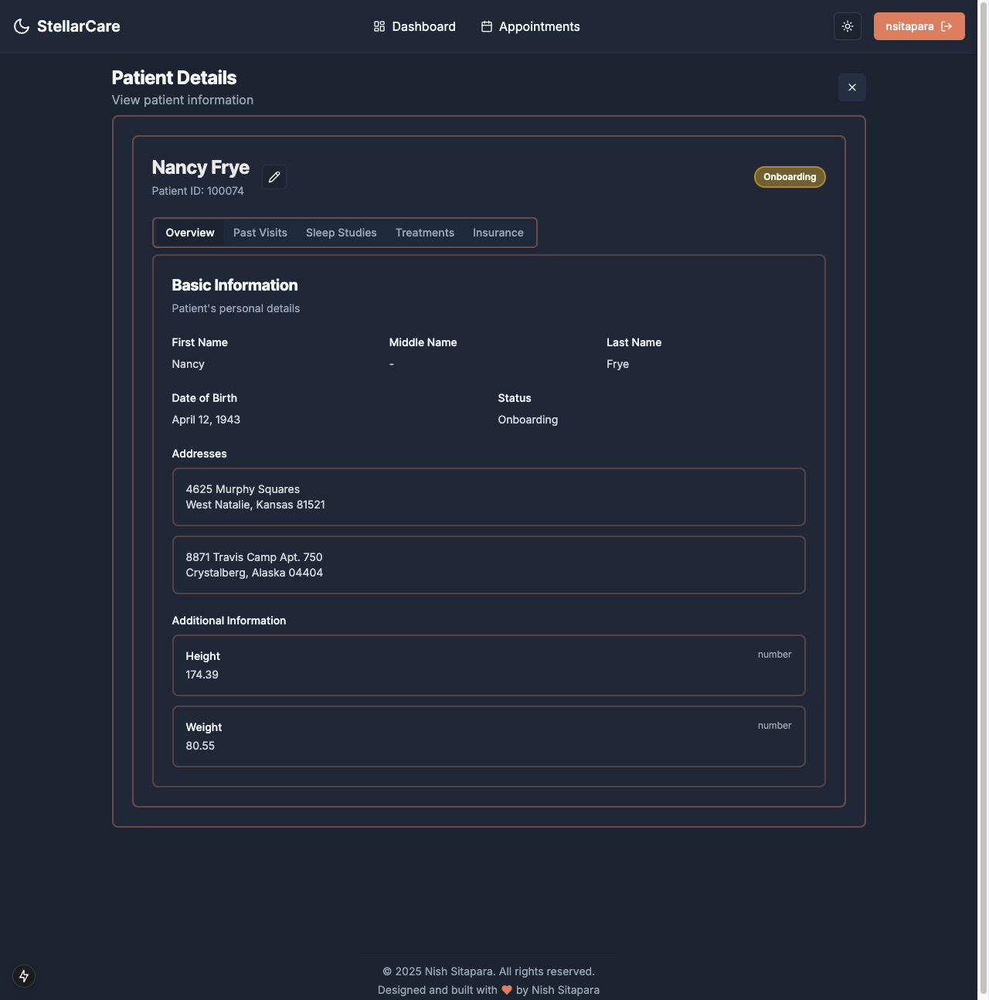
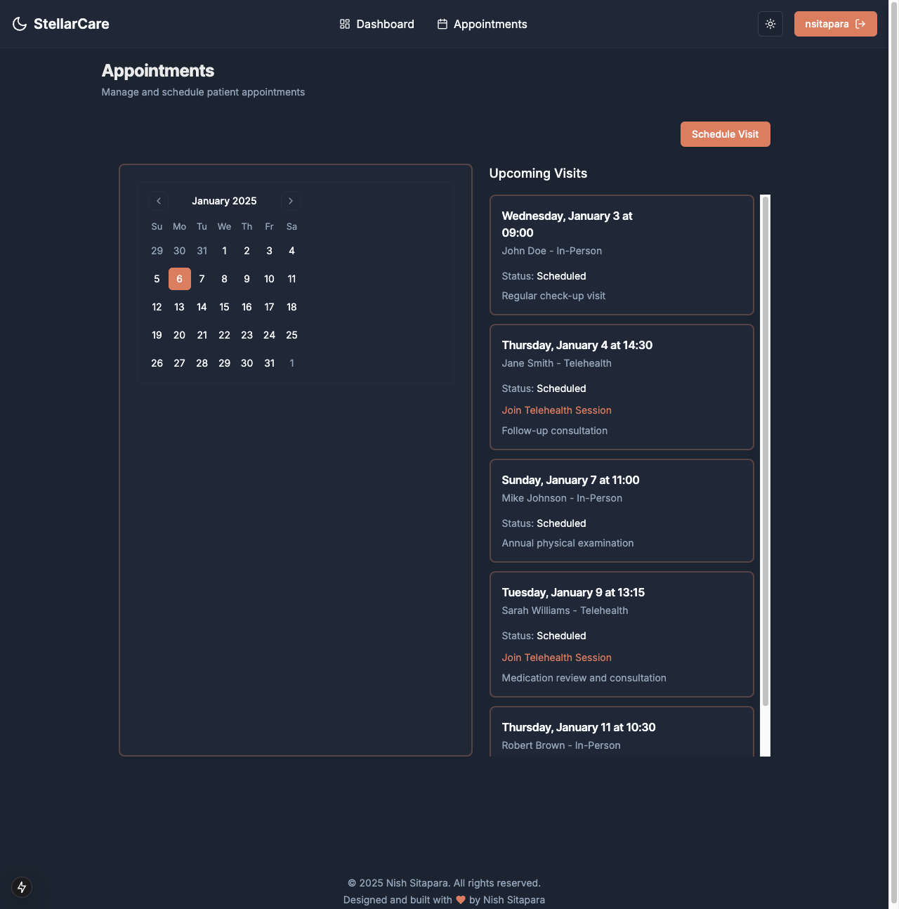

# StellarCare - Healthcare Management System

StellarCare is a modern, full-stack healthcare management system built with Django and Next.js. It provides a comprehensive solution for managing patient data, appointments, and healthcare workflows.

## 📸 Screenshots

<div style="display: grid; grid-template-columns: repeat(auto-fit, minmax(250px, 1fr)); gap: 20px; margin: 20px 0;">
    <a href="images/HomeScreen.png" target="_blank">
        
    </a>
    <a href="images/SignIn.png" target="_blank">
        
    </a>
    <a href="images/SignUp.png" target="_blank">
        
    </a>
    <a href="images/DashBoard.png" target="_blank">
        
    </a>
    <a href="images/NewPatient.png" target="_blank">
        
    </a>
    <a href="images/PatientDetails.png" target="_blank">
        
    </a>
    <a href="images/Appointments.png" target="_blank">
        
    </a>
</div>

## 🌟 Features

- **Modern Tech Stack**: Built with Django 5.1 (Backend) and Next.js 15 (Frontend)
- **Beautiful UI**: Sleek interface built with Tailwind CSS and Radix UI components
- **Type-Safe**: Full TypeScript support with OpenAPI schema generation
- **Authentication**: Secure JWT-based authentication system
- **Patient Management**: Comprehensive patient data management system
- **Dashboard**: Interactive dashboard for healthcare metrics
- **Responsive Design**: Works seamlessly on desktop and mobile devices

## 📸️ Helpful Commands

### Initial Setup
```bash
# Start all services with initial setup (creates DB, runs migrations, creates superuser)
docker compose --profile setup up

# Start services in detached mode
docker compose up -d
```

### Database Management
```bash
# Run database migrations
docker compose exec api uv run -- python manage.py migrate

# Generate mock data (creates sample patients and records)
docker compose exec api uv run -- python manage.py generate_mock_data
```

### Development Commands
```bash
# Backend shell access
docker compose exec api bash

# Frontend shell access
docker compose exec web bash

# Install backend dependencies
docker compose exec api uv sync

# Install frontend dependencies
docker compose exec web pnpm install

# Build frontend for production
docker compose exec web pnpm build

# View logs
docker compose logs -f

# View logs for specific service
docker compose logs -f [api|web|db]
```

### Environment Variables
```bash
# Production mode for frontend
export BUILD_ENV=production
docker compose up web

# Development mode (default)
export BUILD_ENV=development
docker compose up web
```

### Cleanup Commands
```bash
# Stop all services
docker compose down

# Remove all containers and volumes (clean slate)
docker compose down -v

# Remove all containers, volumes, and images
docker compose down -v --rmi all
```


## 🚀 Getting Started

### Prerequisites

- Docker and Docker Compose
- Node.js 18+ (for local development)
- Python 3.13+ (for local development)
- pnpm (recommended) or npm

### Quick Start with Docker

1. Clone the repository:
```bash
git clone https://github.com/yourusername/stellarcare.git
cd stellarcare
```

2. Set up environment variables:
```bash
# Backend environment setup
cp .env.backend.template .env.backend
# Set SECRET_KEY and DEBUG=1 for development

# Frontend environment setup
cp .env.frontend.template .env.frontend
# Generate NEXTAUTH_SECRET with: openssl rand -base64 32
```

3. Start the application:
```bash
docker compose up
```

The application will be available at:
- Frontend: http://localhost:3000
- Backend API: http://localhost:8000
- API Documentation: http://localhost:8000/api/schema/swagger-ui/

## 🏗️ Project Structure

### Backend (Django)
```
backend/
├── api/                    # Main Django application
│   ├── views/             # API endpoints
│   ├── serializers/       # API serializers
│   ├── management/        # Django management commands
│   │   └── commands/      # Custom commands like generate_mock_data
│   ├── migrations/        # Database migrations
│   ├── tests/             # Test suite
│   ├── models.py          # Database models
│   ├── admin.py          # Admin interface configuration
│   ├── api.py            # API viewsets and routes
│   ├── urls.py           # URL routing
│   └── settings.py       # Django settings
├── .venv/                 # Python virtual environment
├── manage.py             # Django management script
├── pyproject.toml        # Python dependencies and tools config
├── uv.lock               # Dependency lock file
└── Dockerfile            # Container configuration
```

### Frontend (Next.js)
```
frontend/
├── app/                    # Next.js application
│   ├── (auth)/            # Authentication routes
│   ├── actions/           # Server actions
│   ├── api/               # API routes
│   ├── appointments/      # Appointment management
│   ├── components/        # Reusable UI components
│   ├── dashboard/         # Dashboard views
│   ├── lib/               # Utility functions
│   ├── patients/          # Patient management
│   ├── styles/            # Global styles
│   ├── layout.tsx         # Root layout
│   └── page.tsx           # Home page
├── providers/             # React context providers
├── public/               # Static assets
├── types/                # TypeScript definitions
├── .next/                # Next.js build output
├── node_modules/         # Dependencies
├── tsconfig.json        # TypeScript configuration
├── tailwind.config.ts   # Tailwind CSS configuration
├── next.config.ts       # Next.js configuration
├── next-auth-d.ts       # NextAuth type definitions
├── postcss.config.mjs   # PostCSS configuration
├── package.json         # Project dependencies
├── pnpm-lock.yaml      # Dependency lock file
└── Dockerfile          # Container configuration
```

## 🧪 Testing

### Backend Tests
```bash
# Run all tests
docker compose exec api uv run -- pytest .

# Run specific test file
docker compose exec api uv run -- pytest api/tests/test_api.py

# Run specific test
docker compose exec api uv run -- pytest api/tests/test_api.py -k "test_name"
```

### Frontend Tests
[Add frontend testing instructions when implemented]

## 🛠️ Development Tools

### VS Code Setup
The project includes VS Code configurations for development containers. To use them:

1. Install the "Remote - Containers" extension
2. Open the project in VS Code
3. Click "Reopen in Container" when prompted
4. Select either frontend or backend container

### API Documentation
- Django Dashboard: http://localhost:8000/admin/
- OpenAPI Schema: http://localhost:8000/api/schema/
- Swagger UI: http://localhost:8000/api/schema/swagger-ui/

### Updating API Types
After making changes to the backend API:
```bash
docker compose exec web pnpm openapi:generate
```

## 📝 License

This project is licensed under the MIT License - see below for details:

```
MIT License

Copyright (c) 2024 Nish Sitapara

Permission is hereby granted, free of charge, to any person obtaining a copy
of this software and associated documentation files (the "Software"), to deal
in the Software without restriction, including without limitation the rights
to use, copy, modify, merge, publish, distribute, sublicense, and/or sell
copies of the Software, and to permit persons to whom the Software is
furnished to do so, subject to the following conditions:

The above copyright notice and this permission notice shall be included in all
copies or substantial portions of the Software.

THE SOFTWARE IS PROVIDED "AS IS", WITHOUT WARRANTY OF ANY KIND, EXPRESS OR
IMPLIED, INCLUDING BUT NOT LIMITED TO THE WARRANTIES OF MERCHANTABILITY,
FITNESS FOR A PARTICULAR PURPOSE AND NONINFRINGEMENT. IN NO EVENT SHALL THE
AUTHORS OR COPYRIGHT HOLDERS BE LIABLE FOR ANY CLAIM, DAMAGES OR OTHER
LIABILITY, WHETHER IN AN ACTION OF CONTRACT, TORT OR OTHERWISE, ARISING FROM,
OUT OF OR IN CONNECTION WITH THE SOFTWARE OR THE USE OR OTHER DEALINGS IN THE
SOFTWARE.
```
