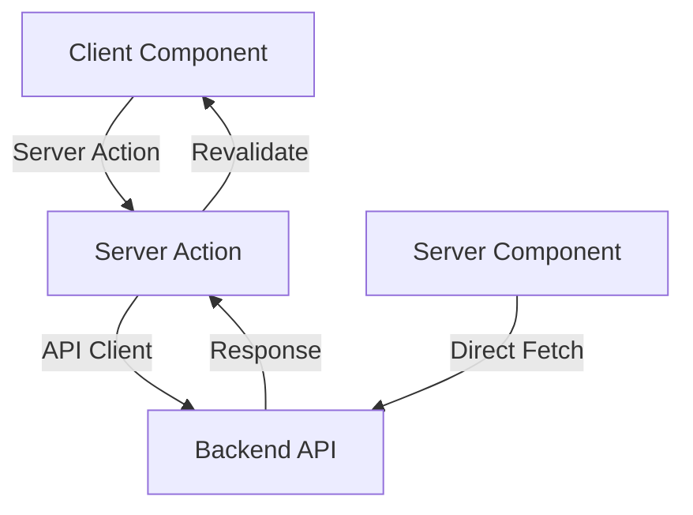
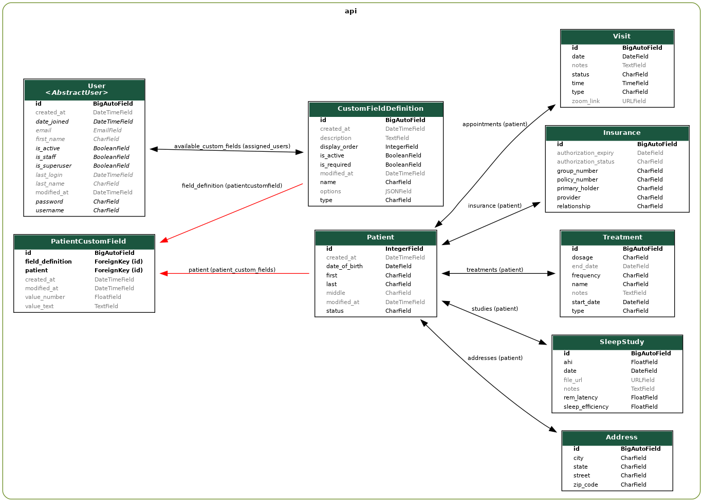

# StellarCare - Healthcare Management System

StellarCare is a modern, full-stack healthcare management system built with Django and Next.js. It provides a comprehensive solution for managing patient data, appointments, and healthcare workflows.

## 🌟 Features

- **Modern Tech Stack**: Built with Django 5.1 (Backend) and Next.js 15 (Frontend)
- **Beautiful UI**: Sleek interface built with Tailwind CSS and Radix UI components
- **Type-Safe**: Full TypeScript support with OpenAPI schema generation
- **Authentication**: Secure JWT-based authentication system
- **Patient Management**: Comprehensive patient data management system
- **Dashboard**: Interactive dashboard for healthcare metrics
- **Responsive Design**: Works seamlessly on desktop and mobile devices

## 📸️ Helpful Commands

### Initial Setup
```bash
# Start all services with initial setup (creates DB, runs migrations, creates superuser)
docker compose --profile setup up -d

# Start services in detached mode
docker compose up -d
```

### Database Management
```bash
# Run database migrations
docker compose exec api uv run -- python manage.py migrate

# Generate mock data (creates sample patients and records)
docker compose exec api uv run -- python manage.py generate_mock_data
```

### Development Commands
```bash
# Backend shell access
docker compose exec api bash

# Frontend shell access
docker compose exec web bash

# Install backend dependencies
docker compose exec api uv sync

# Install frontend dependencies
docker compose exec web pnpm install

# Build frontend for production
docker compose exec web pnpm build

# View logs
docker compose logs -f

# View logs for specific service
docker compose logs -f [api|web|db]
```

### Environment Variables
```bash
# Production mode for frontend
export BUILD_ENV=production
docker compose up web

# Development mode (default)
export BUILD_ENV=development
docker compose up web
```

### Cleanup Commands
```bash
# Stop all services
docker compose down

# Remove all containers and volumes (clean slate)
docker compose down -v

# Remove all containers, volumes, and images
docker compose down -v --rmi all
```


## 🚀 Getting Started

### Prerequisites

- Docker and Docker Compose
- Node.js 18+ (for local development)
- Python 3.13+ (for local development)
- pnpm (recommended) or npm

### Quick Start with Docker

1. Clone the repository:
```bash
git clone https://github.com/yourusername/stellarcare.git
cd stellarcare
```

2. Set up environment variables:
```bash
# Backend environment setup
cp .env.backend.template .env.backend
# Set SECRET_KEY and DEBUG=1 for development

# Frontend environment setup
cp .env.frontend.template .env.frontend
# Generate NEXTAUTH_SECRET with: openssl rand -base64 32
```

3. Start the application:
```bash
docker compose up
```

The application will be available at:
- Frontend: http://localhost:3000
- Backend API: http://localhost:8000
- API Documentation: http://localhost:8000/api/schema/swagger-ui/

## 🏗️ Project Structure

### Backend (Django)
```
backend/
├── api/                    # Main Django application
│   ├── views/             # API endpoints
│   ├── serializers/       # API serializers
│   ├── management/        # Django management commands
│   │   └── commands/      # Custom commands like generate_mock_data
│   ├── migrations/        # Database migrations
│   ├── tests/             # Test suite
│   ├── models.py          # Database models
│   ├── admin.py          # Admin interface configuration
│   ├── api.py            # API viewsets and routes
│   ├── urls.py           # URL routing
│   └── settings.py       # Django settings
├── .venv/                 # Python virtual environment
├── manage.py             # Django management script
├── pyproject.toml        # Python dependencies and tools config
├── uv.lock               # Dependency lock file
└── Dockerfile            # Container configuration
```

### Frontend (Next.js)
```
frontend/
├── app/                    # Next.js application
│   ├── (auth)/            # Authentication routes
│   ├── actions/           # Server actions
│   ├── api/               # API routes
│   ├── appointments/      # Appointment management
│   ├── components/        # Reusable UI components
│   ├── dashboard/         # Dashboard views
│   ├── lib/               # Utility functions
│   ├── patients/          # Patient management
│   ├── styles/            # Global styles
│   ├── layout.tsx         # Root layout
│   └── page.tsx           # Home page
├── providers/             # React context providers
├── public/               # Static assets
├── types/                # TypeScript definitions
├── .next/                # Next.js build output
├── node_modules/         # Dependencies
├── tsconfig.json        # TypeScript configuration
├── tailwind.config.ts   # Tailwind CSS configuration
├── next.config.ts       # Next.js configuration
├── next-auth-d.ts       # NextAuth type definitions
├── postcss.config.mjs   # PostCSS configuration
├── package.json         # Project dependencies
├── pnpm-lock.yaml      # Dependency lock file
└── Dockerfile          # Container configuration
```

## 🧪 Testing

### Backend Tests
```bash
# Run all tests
docker compose exec api uv run -- pytest .

# Run specific test file
docker compose exec api uv run -- pytest api/tests/test_api.py

# Run specific test
docker compose exec api uv run -- pytest api/tests/test_api.py -k "test_name"
```

### Frontend Tests
[Add frontend testing instructions when implemented]

## 🛠️ Development Tools

### VS Code Setup
The project includes VS Code configurations for development containers. To use them:

1. Install the "Remote - Containers" extension
2. Open the project in VS Code
3. Click "Reopen in Container" when prompted
4. Select either frontend or backend container

### API Documentation
- Django Dashboard: http://localhost:8000/admin/
- OpenAPI Schema: http://localhost:8000/api/schema/
- Swagger UI: http://localhost:8000/api/schema/swagger-ui/

### Updating API Types
After making changes to the backend API:
```bash
docker compose exec web pnpm openapi:generate
```

## 📝 Frontend Technical Design

### Architecture Overview

The frontend is built with Next.js 14+ using the App Router pattern, featuring:

#### Core Technologies
- **Next.js App Router**: Server-first React framework with RSC support
- **TypeScript**: Full type safety across the application
- **Tailwind CSS**: Utility-first styling with custom theme
- **Radix UI**: Accessible component primitives
- **Shadcn/ui**: Pre-built component system based on Radix
- **React Hook Form**: Form handling with validation
- **Zod**: Schema validation for forms and API data

### Directory Structure
```
frontend/app/
├── (auth)/              # Authentication routes and components
│   ├── login/          # Login page and form
│   ├── register/       # Registration page and form
│   └── layout.tsx      # Auth-specific layout
├── actions/            # Server actions for data mutations
│   ├── patient/        # Patient-related actions
│   └── auth/          # Authentication actions
├── api/                # API route handlers
├── components/         # Reusable UI components
│   ├── dashboard/     # Dashboard-specific components
│   ├── forms/         # Form components and fields
│   ├── layout/        # Layout components
│   ├── patients/      # Patient management components
│   └── ui/            # Base UI components
├── lib/                # Utility functions and configurations
│   ├── api-client.ts  # Generated API client
│   ├── auth.ts        # Authentication configuration
│   └── utils.ts       # Helper functions
└── providers/         # React context providers
```

### Key Features

#### Server Components
- **React Server Components**: Leverages Next.js 14's server-first approach
- **Server Actions**: Direct server mutations without API endpoints
- **Streaming**: Progressive loading with Suspense boundaries

#### Type Safety
- **End-to-end Type Safety**: Generated types from OpenAPI schema
- **Zod Validation**: Runtime type checking for forms and API data
- **TypeScript**: Static type checking across components

#### Authentication
- **Next-Auth**: JWT-based authentication with session management
- **Protected Routes**: Middleware-based route protection
- **Role-based Access**: Component-level access control

#### State Management
- **React Context**: Global state management
- **React Query**: Server state management
- **Form State**: Managed by React Hook Form

#### UI/UX
- **Responsive Design**: Mobile-first approach
- **Dark Mode**: System-based and manual theme switching
- **Loading States**: Optimistic updates and loading skeletons
- **Error Handling**: Graceful error boundaries and fallbacks

### Data Flow



### Performance Optimizations
- **Static Generation**: Where possible for faster page loads
- **Dynamic Imports**: Code splitting for optimal bundle size
- **Image Optimization**: Next.js Image component for optimal loading
- **Caching Strategy**: SWR/React Query for data caching
- **Prefetching**: Route and data prefetching for faster navigation

## 🗄️ Database and API Design

### Database Schema

The application uses a PostgreSQL database with the following key models:

### Entity Relationship Diagram (ERD)

Below is the Entity Relationship Diagram showing the relationships between different models in the system:



#### Core Models
- **User**: Extended Django user model with custom field access control
- **Patient**: Central model for patient management with auto-incrementing IDs (starting from 100000)
- **Address**: Flexible address storage supporting multiple addresses per patient

#### Custom Fields System
- **CustomFieldDefinition**: Defines dynamic custom fields with types (text, number)
- **PatientCustomField**: Stores patient-specific custom field values

#### Medical Records
- **SleepStudy**: Tracks sleep study metrics (AHI, efficiency, REM latency)
- **Treatment**: Manages treatments and medications
- **Insurance**: Handles insurance and authorization information
- **Visit**: Manages appointments (in-person/telehealth)

### API Structure

The API is organized into logical modules:

```
api/views/
├── base.py          # Base viewset configurations
├── custom_fields.py # Custom field management
├── medical.py       # Medical record endpoints
├── patient.py       # Patient CRUD operations
└── records.py       # General record keeping
```

#### Key Features
- **Dynamic Fields**: Flexible custom field system for patient data
- **Temporal Tracking**: All models include created_at/modified_at timestamps
- **Relationship Management**: Comprehensive tracking of patient relationships
- **Status Workflows**: Patient and visit status management
- **Access Control**: User-specific custom field availability

## 📝 License

This project is licensed under the MIT License - see below for details:

```
MIT License

Copyright (c) 2024 Nish Sitapara

Permission is hereby granted, free of charge, to any person obtaining a copy
of this software and associated documentation files (the "Software"), to deal
in the Software without restriction, including without limitation the rights
to use, copy, modify, merge, publish, distribute, sublicense, and/or sell
copies of the Software, and to permit persons to whom the Software is
furnished to do so, subject to the following conditions:

The above copyright notice and this permission notice shall be included in all
copies or substantial portions of the Software.

THE SOFTWARE IS PROVIDED "AS IS", WITHOUT WARRANTY OF ANY KIND, EXPRESS OR
IMPLIED, INCLUDING BUT NOT LIMITED TO THE WARRANTIES OF MERCHANTABILITY,
FITNESS FOR A PARTICULAR PURPOSE AND NONINFRINGEMENT. IN NO EVENT SHALL THE
AUTHORS OR COPYRIGHT HOLDERS BE LIABLE FOR ANY CLAIM, DAMAGES OR OTHER
LIABILITY, WHETHER IN AN ACTION OF CONTRACT, TORT OR OTHERWISE, ARISING FROM,
OUT OF OR IN CONNECTION WITH THE SOFTWARE OR THE USE OR OTHER DEALINGS IN THE
SOFTWARE.
```

## 📸 Screenshots

<div style="display: grid; grid-template-columns: repeat(auto-fit, minmax(250px, 1fr)); gap: 20px; margin: 20px 0;">
    <a href="images/HomeScreen.png" target="_blank">
        
    </a>
    <a href="images/SignIn.png" target="_blank">
        
    </a>
    <a href="images/SignUp.png" target="_blank">
        
    </a>
    <a href="images/DashBoard.png" target="_blank">
        
    </a>
    <a href="images/NewPatient.png" target="_blank">
        
    </a>
    <a href="images/PatientDetails.png" target="_blank">
        
    </a>
    <a href="images/Appointments.png" target="_blank">
        
    </a>
</div>

## 🙏 Acknowledgments

This project was bootstrapped using [Turbo](https://github.com/unfoldadmin/turbo), a Django & Next.js boilerplate template. The base template was adapted and customized to create this healthcare management system with additional features and domain-specific functionality.
